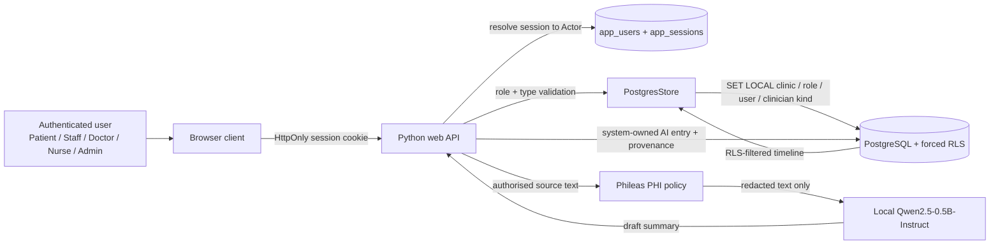
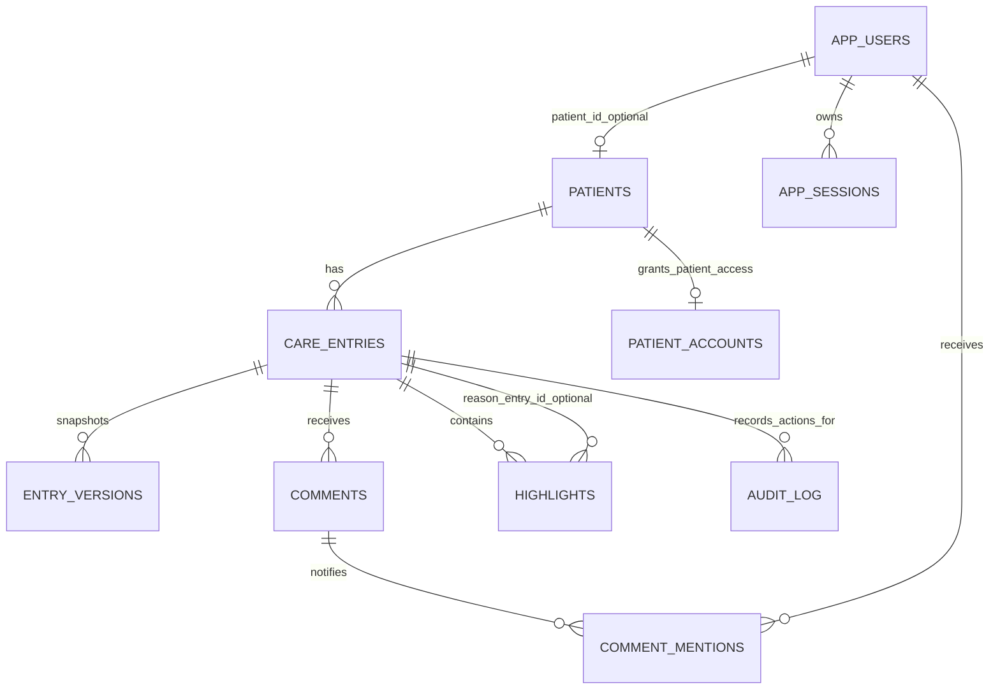

# Nightingale technical brief

## 1. Architecture and trust boundaries

Nightingale is a local, PostgreSQL-backed longitudinal care-record prototype. Its core design decision is that the database record—not an AI output or browser state—is the source of truth. The browser is a thin, role-aware client; authorization and data filtering are enforced by the Python server and PostgreSQL row-level security (RLS).

### Request lifecycle

1. The user logs in with a password verified against a salted password hash. The server stores only a digest of an opaque session token and sends the token as an HttpOnly, `SameSite=Strict` cookie.
2. On every authenticated API request, the server resolves that cookie to an active `app_users` record and creates an `Actor` containing user ID, clinic ID, role, and, for clinicians, doctor/nurse subtype. Browser-supplied role headers are ignored.
3. `PostgresStore.request()` opens one transaction and sets `app.clinic_id`, `app.role`, `app.user_id`, and `app.clinician_kind` with `set_config(..., true)`. PostgreSQL policies inspect only these transaction-local claims.
4. The service/repository validates role-to-record-type rules before mutation; PostgreSQL RLS repeats the clinic, visibility, and write checks. The UI may hide an unavailable action, but it cannot grant access.
5. For AI work, only an already RLS-visible record or timeline is passed to `redact_for_llm()`. Phileas redacts it before `generate_scribe()` or `generate_glance()` calls local Qwen. A redaction failure blocks the AI request rather than falling back to raw text.

This creates two independent authorization layers: Python rejects an invalid action early with a useful error, while forced RLS applies the same scope rules to every query made with the runtime application role. `nightingale_app` is the runtime database role; migrations are performed through a separate owner/administrator connection. As with any database design, the owner credentials and application connection string are privileged secrets and must not be exposed to end users.

## 2. Data schema and traceability

`care_entries` is the central timeline table. There is no separate “AI note” table: an AI-scribed note is a normal entry with a system author, `section = ai_scribed`, and `entry_type = ai_scribe_log`. Treating AI notes as entries makes their display, authorization, audit trail, version behavior, and links consistent with all other record types.

| Entity | Key fields and relationship | Purpose |
|---|---|---|
| `patients` | `id`, `clinic_id`, `display_label` | Clinic-scoped patient page. `care_entries.patient_id` references it. |
| `care_entries` | `id`, `patient_id`, `clinic_id`, `section`, `entry_type`, `content`, `author_id`, `author_role`, `version`, `provenance_pointer`, tags/risk/open-action fields | Canonical timeline row and clinical source of truth. The eight permitted `entry_type` values are system event, AI scribe log, doctor consult, nurse consult, AI–patient consult, staff manual log, clinician manual log, and patient-facing log. |
| `entry_versions` | composite primary key: `(entry_id, version)`; `content`, `changed_by`, `change_reason`, `changed_at` | Immutable content snapshots. Editing updates the current entry and adds a new version; reverting copies a selected old snapshot into a new version rather than deleting history. |
| `comments` | `id`, `entry_id`, author fields, `body`, mention/assignment, `resolved` | Internal discussion attached to one entry. Patient access is blocked by policy. |
| `comment_mentions` | composite key `(comment_id, mentioned_user_id)`, `clinic_id`, `read_at`, `created_at` | Durable notification inbox. Each recipient has an independent read state; RLS exposes a row only to its recipient or the comment author where appropriate. |
| `highlights` | `id`, `patient_id`, `entry_id`, span offsets, `risk_reason`, `origin`, `reason_entry_id`, `provenance_pointer`, `accepted` | A keyword/span annotation on an entry. `origin` distinguishes clinician and AI highlights. `reason_entry_id` is an optional foreign key to the entry explaining why the keyword matters. Multiple highlights may share an entry or provenance source. |
| `audit_log` | `id`, optional `entry_id`, `actor_id`, `action`, JSON `metadata`, timestamp | Append-only operational trace for creates, edits, reverts, highlights, and related actions. It records metadata rather than copying prior clinical content. |
| `app_users`, `app_sessions` | role, clinic, optional clinician kind/patient binding; token digest and expiry | Authentication/session state. Raw passwords and raw tokens are not stored. |
| `patient_accounts` | `patient_id`, `patient_user_id`, `clinic_id` | Explicit link proving which patient user may read which patient page. |
| `importance_feedback` | `(clinic_id, tag)`, `net_score` | Clinic-scoped store reserved for explainable tag-level priority feedback. `clinic_id` is a logical tenant partition; the current prototype has no separate clinics table. |

### Provenance and AI-scribed notes

A Doctor–Patient or Nurse–Patient Consult is first persisted as its own `care_entries` row. The server then redacts the consult text and asks Qwen for a short summary. It persists the result as a second, system-owned `ai_scribe_log` entry whose `provenance_pointer` is `entry:<consult-entry-id>`. The server, not the model, appends the source consult ID to the summary. This avoids trusting a generative model to reproduce an identifier accurately.

Highlights use two complementary links: `entry_id` identifies the text that contains the selected keyword and span; `reason_entry_id`, when present, identifies the visible source that explains the highlight. `provenance_pointer` remains a human-readable trace pointer (for example, `timeline:<entry>#span=start:end` or `entry:<source>`), rather than the sole authority for navigation. Before the UI renders a provenance or AI-summary link, it checks that the current actor can read the target entry.

### RBAC data rules

All RLS-protected tables are clinic scoped. Patients read only their own `patient_facing_log` rows through `patient_accounts`; staff read and write only `staff_manual_log`; clinicians read the full clinic timeline but only write their allowed subtype; admins have clinic-wide oversight; system writes system/AI record types. Doctors may write doctor consults, clinician manual logs, and patient-facing logs. Nurses receive the analogous nurse-consult permission. The database policy checks both `entry_type` and `clinician_kind`, so a doctor cannot manufacture a nurse consult by modifying a client request.

## 3. Learning mechanism, assumptions, and scope decisions

### Learning mechanism: present but intentionally bounded

The prototype contains an explainable, tag-based importance mechanism. `importance.py` computes a score from recency, `risk_level × 20`, `+25` for an open action, and positive learned tag weights. `CareService.record_highlight_feedback()` changes the in-memory weight for an entry’s tags when a clinician accepts or rejects a highlight. The `importance_feedback` table supplies the matching persisted, clinic-scoped schema.

The running web application currently uses Qwen’s constrained, source-cited Glance View rather than this score as its live ranking engine, and it does not yet expose a feedback API that writes the table. Therefore, the learning mechanism is a tested design seam and deterministic test double—not a hidden production learning loop. A production integration should write explicit accept/reject events, update `importance_feedback` transactionally, expose the score/reasons, cap weights, and allow clinicians to inspect or reset learned preferences. It must never alter clinical facts, access rights, or treatment recommendations.

### First-principles assumptions

- **Clinical content must remain attributable.** Every visible conclusion should resolve to a timeline entry, revision, comment, or highlight reason; AI output is derived content, not an authority.
- **Audience separation is a data property.** Patients must never receive internal staff/clinician comments or raw AI-scribed notes. Enforcing this at the query layer is safer than relying on different front-end screens.
- **AI input is a privacy boundary.** Even local model inference is treated as a distinct processing boundary. The system redacts before prompt construction and fails closed on redaction errors.
- **Concurrency is normal.** A current entry carries a version number; edits use optimistic version checks. A stale update is rejected instead of silently overwriting another author’s work.
- **Automation needs a narrow scope.** Qwen produces short summaries and source-cited Glance drafts. It does not diagnose, prescribe, change record permissions, or decide the importance of an item without clinician review.

### Trade-offs and deferred scope

| Decision | Benefit | Cost / deferred work |
|---|---|---|
| Python standard-library HTTP server and static front end | Small, inspectable local prototype with no frontend build chain | Not a production API deployment; add a hardened ASGI service, TLS termination, rate limits, observability, and CSRF review. |
| PostgreSQL RLS plus application checks | Defence in depth and clinic-scoped enforcement close to data | Requires disciplined use of the restricted runtime role and transaction-local claims; owner credentials must never serve requests. |
| Text provenance pointers plus foreign keys where available | Human-readable links and easy timeline navigation | A production provenance graph should use typed source tables/foreign keys for every pointer and validate cross-entry clinic ownership. |
| Local Phileas policy | Deterministic, auditable masking without transmitting raw text to a remote DLP vendor | Regex/pattern coverage is not complete PHI recognition; validate against local policy, add named-entity detection, and monitor false positives/negatives. |
| Local 0.5B Qwen model | Low-cost local draft generation | Quality and latency are hardware-dependent; use asynchronous jobs, caching, review workflows, and clinical evaluation before deployment. |
| Tag-level learning only | Explainable and reversible | The persisted feedback path is not yet wired into the browser; no autonomous model training is performed. |

The project uses synthetic data only. It is a framework for demonstrating trust boundaries and traceable workflow behavior, not a production-ready clinical record system.
